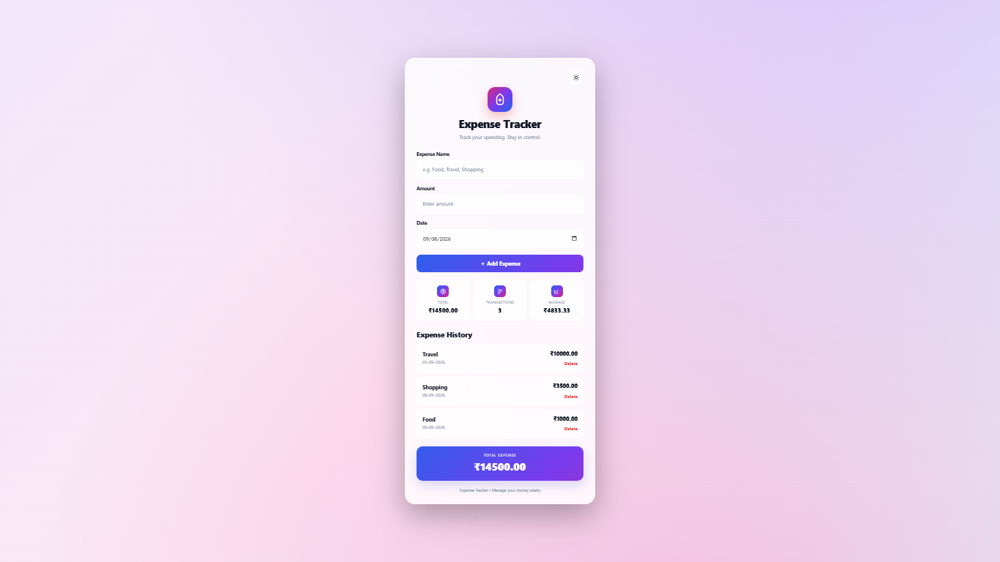
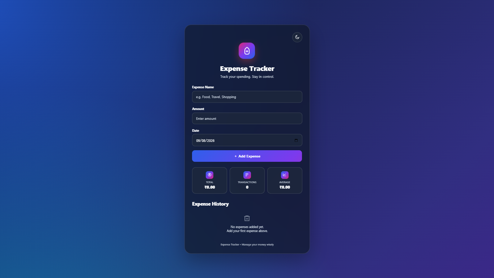

# 💰 EXPENSE TRACKER

### 📊 Full-Stack Web Application for Personal Expense Management

A clean and responsive web application designed to record, track, and manage daily expenses using **Python Flask, SQLite, HTML, CSS, and JavaScript**.

---

## 📌 Project Overview

The **Expense Tracker** is a web-based personal expense management application developed to simplify the process of recording and monitoring daily spending.

Users can add expenses by providing an **expense name, amount, and date**. The application stores expense records using an **SQLite database** and automatically updates important spending statistics such as **Total Expense, Transaction Count, and Average Expense**.

The project combines a modern and intuitive frontend interface with **Flask-based backend logic** and **SQLite database integration**, creating a lightweight and practical expense management system.

---

## 🖼️ Application Preview

### ☀️ Light Mode — Expense Records & Statistics



*Fig1: Expense Tracker displaying recorded expenses with updated spending statistics*

### 🌙 Dark Mode — Clean & Minimal Interface



*Fig2: Expense Tracker displaying the clean interface in Dark Mode*

---

# 🎯 Project Objectives

- 💰 Record and manage daily expenses
- 📝 Store expense name, amount, and date
- 📊 Calculate total spending
- 🔢 Track the number of transactions
- 📈 Calculate average expense
- 📋 Maintain expense history
- 💾 Store expense records using SQLite
- ☀️ Provide Light Mode
- 🌙 Provide Dark Mode
- 🎨 Create a clean and responsive user interface
- ⚡ Develop a lightweight web-based expense management system

---

# 📊 Application Features

## ➕ Expense Management

Users can add a new expense by entering:

- 📝 Expense Name
- 💵 Amount
- 📅 Date

After submitting the form, the expense is stored and displayed in the **Expense History** section.

---

## 💰 Spending Overview

The application provides three important statistics:

- 💰 **Total Expense** — Displays the total amount spent.
- 🔢 **Total Transactions** — Displays the number of recorded expenses.
- 📊 **Average Expense** — Displays the average amount spent per transaction.

---

## 📋 Expense History

All recorded expenses are displayed in the **Expense History** section.

This allows users to review their previously added transactions directly from the application interface.

---

## ☀️ Light Mode

A clean and bright interface designed for comfortable daytime usage with clear visibility of expense information.

---

## 🌙 Dark Mode

A dark-themed interface that provides an alternative viewing experience, particularly useful in low-light environments.

---

## 💾 SQLite Database

The application uses **SQLite** for local and persistent storage of expense records.

SQLite keeps the project lightweight while providing reliable database functionality without requiring a separate database server.

---

# 🛠️ Tools & Technologies Used

| Technology | Purpose |
|---|---|
| 🐍 Python | Backend Application Logic |
| 🌐 Flask | Web Application Framework |
| 🗄️ SQLite | Database Management & Storage |
| 🧱 HTML5 | Webpage Structure |
| 🎨 CSS3 | Styling & User Interface |
| ⚡ JavaScript | Client-Side Interactions |

---

# 🏗️ Application Architecture

```text
                    👤 User
                       ↓
             🧱 HTML / CSS / JavaScript
                       ↓
               🌐 Flask Application
                       ↓
                🗄️ SQLite Database
                       ↓
                💾 Expense Records
                       ↓
          📊 Updated Statistics & History


---

📂 Project Structure

expense-tracker/
│
├── app.py
│
├── expenses.db
│
├── templates/
│   └── index.html
│
├── static/
│   ├── style.css
│   └── script.js
│
├── screenshots/
│   ├── light-mode.png
│   └── dark-mode.png
│
├── .gitignore
├── LICENSE
├── README.md
└── requirements.txt

> Note: The exact file structure may vary depending on the final project implementation.


---

⚙️ How to Develop

1️⃣ Clone the Repository

git clone https://github.com/aakashnath/expense-tracker.git

2️⃣ Navigate to the Project Directory

cd expense-tracker

3️⃣ Create a Virtual Environment

Windows

python -m venv venv

Activate the Virtual Environment

venv\Scripts\activate


---

4️⃣ Install Dependencies

pip install -r requirements.txt

If requirements.txt is not available, Flask can be installed using:

pip install flask


---

5️⃣ Run the Application

python app.py

The Flask development server will start locally.

Open the application in your browser:

http://127.0.0.1:5000


---

🚀 How to Use

Step 1 — Open the Application

Run the Flask application and open the local URL in a web browser.

Step 2 — Add an Expense

Enter:

Expense Name

Amount

Date


Then click the Add Expense button.

Step 3 — View Statistics

The dashboard automatically displays:

💰 Total Expense

🔢 Total Transactions

📊 Average Expense


Step 4 — Check Expense History

Previously added expenses can be viewed in the Expense History section.

Step 5 — Switch Interface Mode

Use the theme control to switch between:

☀️ Light Mode

🌙 Dark Mode


---

💡 Key Highlights

🐍 Flask-based web application

🗄️ SQLite database integration

📊 Automatic expense calculations

📋 Expense history management

☀️ Light and Dark Mode

📱 Responsive user interface

⚡ Lightweight and easy to run locally

🎨 Modern and clean frontend design


---

🔐 Data & Privacy

The application stores expense records locally using SQLite.

No external financial service or payment system is connected to this project.


---

📈 Future Improvements

The project can be further enhanced with features such as:

📊 Expense category-wise analysis

📅 Monthly and yearly spending reports

📈 Expense charts and visual analytics

🔍 Search and filtering

✏️ Edit existing expenses

🗑️ Delete individual expenses

📤 Export expenses to CSV or Excel

🔐 User authentication

☁️ Cloud database integration

📱 Improved mobile responsiveness


---

🎓 Learning Outcomes

Through this project, the following practical concepts were implemented:

🐍 Python programming

🌐 Flask web development

🗄️ SQLite database integration

🔗 Frontend-backend communication

🧱 HTML structure

🎨 CSS styling

⚡ JavaScript interactions

📊 Data calculation and presentation

🗂️ Project organization

🔧 Virtual environment management

🐙 Git and GitHub version control


---

📁 Repository Contents

🐍 app.py — Flask application and backend logic

🧱 index.html — Application interface

🎨 style.css — Application styling

⚡ script.js — Client-side interactions

🗄️ expenses.db — SQLite database

📄 requirements.txt — Python dependencies

🖼️ light-mode.png — Light Mode application preview

🌙 dark-mode.png — Dark Mode application preview

📘 README.md — Project documentation

⚖️ LICENSE — MIT License


---

👨‍💻 Developed By

Aakash Nath

💻 B.Tech — Information Technology

📧 Email: nathaakash855@gmail.com

💼 LinkedIn: https://linkedin.com/in/aakashnath2003


---

🔗 GitHub Repository

https://github.com/aakashnath/expense-tracker


---

⚖️ License

This project is licensed under the MIT License.

You are free to use, modify, and distribute this project in accordance with the terms of the license.

See the LICENSE file for more information.


---

⭐ Support

If you found this project useful or interesting, consider giving the repository a ⭐ Star on GitHub.

Thank you for checking out the Expense Tracker! 💰
